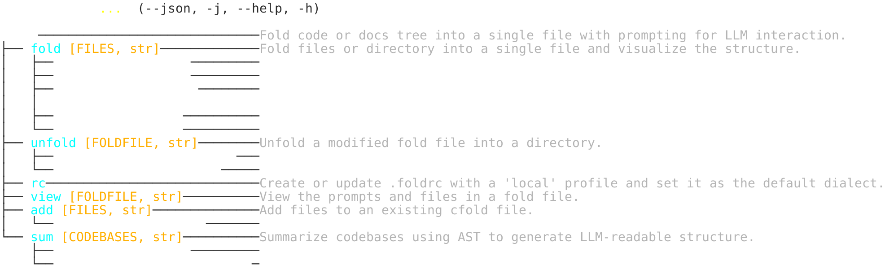
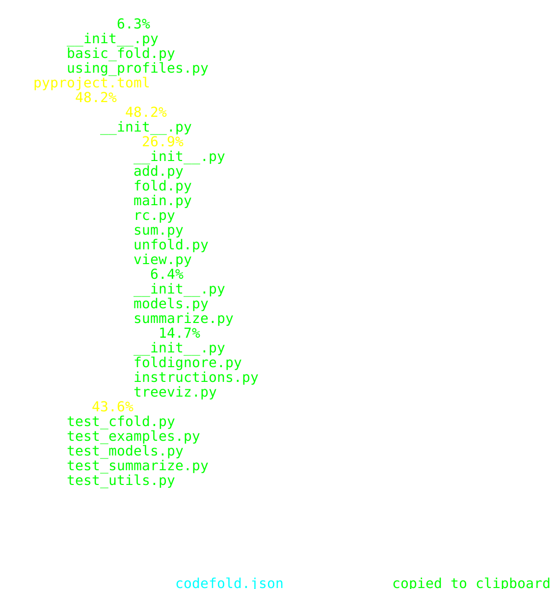

# cfold

- Fold files and instructions into json
- Unfold LLM return jsons in same format
- Intended to let LLMs produce codebase changes in a controlled manner

## Installation

```bash
uv pip install https://github.com/wr1/cfold.git
```

## Usage

### CLI help


### Example output


## Commands

| Command | Description |
|---------|-------------|
| `fold` | Fold a codebase into a JSON file |
| `unfold` | Apply changes from a modified JSON file |
| `add` | Add files to an existing fold file |
| `view` | View the contents of a fold file |
| `sum` | Summarize Python codebases via AST |
| `rc` | Create or update a `.foldrc` config |

## Fold File Format

- JSON structure with keys: `instructions` (list of objects), `files`.
- Each instruction object: `{type: 'system'|'user'|'assistant', content: string, name: string (optional)}`.
- `files`: Array of objects with `path` (relative to CWD), `content` (full file content, optional if deleting), and `delete` (bool, default false).
- Modify files by updating `content` (with `delete: false`).
- Delete files with `delete: true` (content optional).
- Add new files by adding new objects with `path` and `content`.
- Move/rename: Delete old (`delete: true`) and add new with updated path and content.

## Sum Command

The `sum` command summarizes the structure of Python codebases using AST parsing. It generates an LLM-readable summary of classes, functions, and other code elements.

```bash
cfold sum codebase/ codebase2/ -o summary.txt
```

## Agent skill

`SKILL.md` at the repo root teaches agents when to use `sum` vs `fold`/`unfold`
(and how to build a once-per-tip state pack). Symlink into your agent skills dir,
e.g. `ln -sf /path/to/cfold/SKILL.md ~/.claude/skills/cfold/SKILL.md`.

## License

MIT
