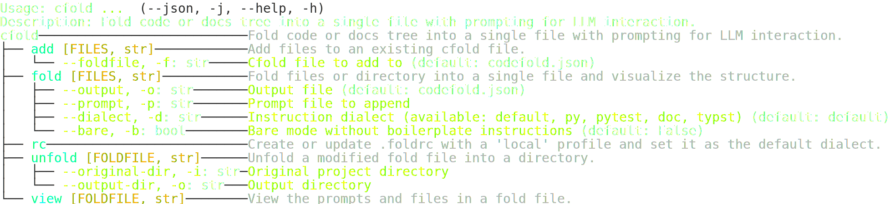

# cfold

<!-- `cfold` is a command-line tool that helps you prepare codebases for interaction with Large Language Models (LLMs). It can `fold` a directory of code into a single JSON file and `unfold` a modified version back into a directory structure. -->

- Fold files and instructions into json
- Unfold LLM return jsons in same format
- Intended to let LLM's produce codebase changes in a controlled manner


## Installation

```bash
uv pip install https://github.com/wr1/cfold.git
```

## Usage

<!--  -->


### CLI help


### Example output


## Fold File Format

- JSON structure with keys: `instructions` (list of objects), `files`.
- Each instruction object: `{type: 'system'|'user'|'assistant', content: string, name: string (optional)}`.
- `files`: Array of objects with `path` (relative to CWD), `content` (full file content, optional if deleting), and `delete` (bool, default false).
- Modify files by updating `content` (with `delete: false`).
- Delete files with `delete: true` (content optional).
- Add new files by adding new objects with `path` and `content`.
- Move/rename: Delete old (`delete: true`) and add new with updated path and content.

