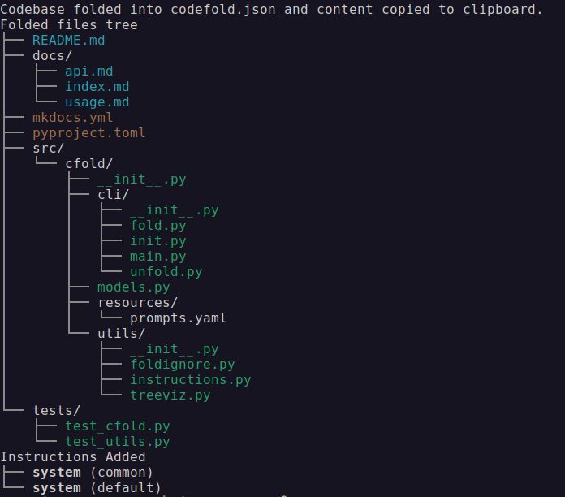

# cfold

`cfold` is a command-line tool that helps you prepare codebases for interaction with Large Language Models (LLMs). It can "fold" a directory of code into a single JSON file and "unfold" a modified version back into a directory structure.

## Installation

```bash
pip install .
```

Or install locally with UV:

```bash
uv pip install .
```

## Usage

### Folding a codebase

Fold specific files or the current directory into a single JSON file:

```bash
cfold fold [files...] -o <output_file> [--prompt <prompt_file>] [--dialect <dialect>]
```

- `[files...]`: Specific files to fold (optional; if omitted, folds the entire current directory).
- `-o <output_file>`: Output file (default: `codefold.json`).
- `--prompt <prompt_file>`: Optional file to append as a prompt in the output.
- `--dialect <dialect>`: Dialect for instructions (e.g., `default`, `codeonly`, `doconly`, `latex`, `typst`; default: `default`).
- Supports `.foldignore` for excluding files when folding a directory.

Example (fold only code files):

```bash
cfold fold -o folded.json --dialect codeonly
```

Or simply
```bash
cfold fold
```


The output file can then be sent to an LLM either through the GUI or through a tool like [grk](https://github.com/wr1/grk). 

After folding, a visualization of the file tree and added instructions (by category: Common System, Dialect System, User, Assistant) is printed.

### Unfolding a codebase

Unfold a modified fold file back into a directory structure:

```bash
cfold unfold <fold_file> [-i <original_dir>] [-o <output_dir>]
```

- `<fold_file>`: The modified fold file to unfold.
- `-i <original_dir>`: Original directory to merge with (optional).
- `-o <output_dir>`: Output directory (default: CWD).

Example:

```bash
cfold unfold folded.json -o output_dir
```

### Initializing a project template

Create a template file with LLM instructions for project setup:

```bash
cfold init [<output_file>] [--custom <instruction>] [--dialect <dialect>]
```

- `<output_file>`: Output file (default: `start.json`).
- `--custom <instruction>`: Custom instruction for the LLM.
- `--dialect <dialect>`: Dialect for instructions (e.g., `default`, `codeonly`, `doconly`; default: `default`).

Example:

```bash
cfold init start.json --custom "Build a Python CLI tool." --dialect default
```

## Fold File Format

- JSON structure with keys: `system`, `user`, `assistant`, `files`.
- `system`: LLM system instructions (common + dialect-specific).
- `user`: User prompt (optional, can include custom prompt).
- `assistant`: Assistant instructions (optional).
- `files`: Array of objects with `path` (relative to CWD) and `content` (full file content).
- Modify files by updating `content`.
- Delete files with `content: "# DELETE"`.
- Add new files by adding new objects.
- Move/rename: Delete old and add new with updated path and content.

